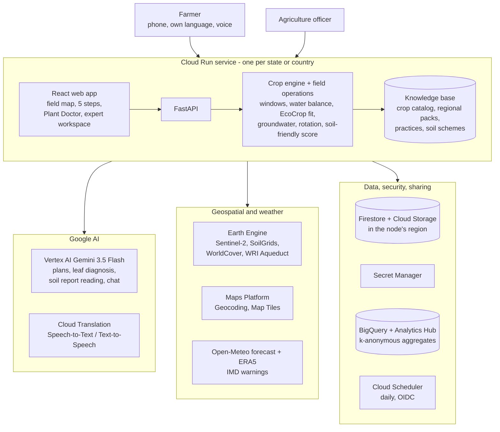
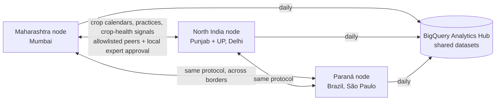

# KISANAI — AgriN Regenerative Agricultural Intelligence

**Field-level farm advice from satellite, soil and weather, in the farmer's own language, on an open network where Indian states, and BRICS partner countries, share agricultural knowledge.**

Built for *Build with AI: Code for Communities, Second Edition*, **Track 04 Agricultural Intelligence** (theme: Cooperation). Licence: Apache-2.0.

## Live deployment

Three independent nodes run on Google Cloud Run. Each one belongs to one agriculture department and keeps its data in its own cloud region.

| Node | Serves | Region | Farmer languages | Open |
|---|---|---|---|---|
| Maharashtra | India, `IN-MH` | `asia-south1` (Mumbai) | Marathi, Hindi, English | **https://kisanai-in-mh-313370978552.asia-south1.run.app** |
| North India | India, `IN-PB` Punjab + `IN-UP` Uttar Pradesh | `asia-south2` (Delhi) | Hindi, Punjabi\*, English | **https://kisanai-in-north-313370978552.asia-south2.run.app** |
| Paraná | Brazil, `BR-PR` | `southamerica-east1` (São Paulo) | Portuguese\*, English | **https://kisanai-br-pr-313370978552.southamerica-east1.run.app** |

\* Machine-translated automatically with Google Cloud Translation. A few Portuguese strings are corrected by hand in `data/i18n/pt-BR.json`.

Each node also exposes:
- a public manifest at `/.well-known/agrin-node` (for example the [Maharashtra manifest](https://kisanai-in-mh-313370978552.asia-south1.run.app/.well-known/agrin-node));
- a health check at `/health`.

---

## The problem

Small and marginal farmers in India decide every week:
- Is it time to sow?
- Can I spray tomorrow?
- Which crop fits my water, my soil and last season's crop?
- What is wrong with this leaf?

The answers exist, but they are scattered:
- State agricultural universities publish sowing calendars as PDFs.
- Forecasts are not translated into field operations.
- Soil Health Cards are hard to read.
- Satellite data is free but unused at farm level.

Each state also keeps its knowledge to itself. When Punjab's groundwater crisis or a pest outbreak in a neighbouring district matters to Maharashtra, there is no shared digital infrastructure to pass that knowledge on.

**KISANAI** combines all of this for one plotted field, explains it in the farmer's language, and connects state agriculture departments so they can share reviewed crop calendars, practices and anonymous crop-health signals. The same protocol works across BRICS borders.

**Who it serves:**
- **Farmers:** no login and no phone number, and it works by voice.
- **Extension officers and agriculture departments:** an expert workspace, case review, a district dashboard, and exchange with other states.

---

## Try the demo (10 minutes)

Use a phone or a desktop browser. Everything below runs on the live nodes with live data. Every node's home page has a **Nodes in this network** section that links to the other states and countries, so you can move between them in one tap.

### 1. A farmer in Maharashtra

1. Open the **[Maharashtra node](https://kisanai-in-mh-313370978552.asia-south1.run.app)** and pick **मराठी** or **English**.
2. Tap **Add my farm** and search `Zadgaon Yavatmal`. You can also type a PIN code such as `445001`, or tap **GPS**.
3. On the Google satellite map, **tap 3–4 corners of a field**. The area fills in automatically. Choose water (*rain only*), soil (*black*) and last season's crop (*soybean*), then **Save**.
4. **Weather:** see today's sowing, spraying, irrigation and drainage windows, the 7-day forecast and the pest-risk weather.
5. **Soil:** upload a photo of a Soil Health Card, or type values such as pH `6.4`, N `190`, P `12`. They are rated against the Soil Health Card limits, with what each rating means.
6. **Crops:** crops you can sow now, ranked, each with a *fit* score, a *soil-friendly* score, its sowing window and water balance. Tap **Why?** for every reason and its source.
7. **Plan:**
   - Tap **Make my plan**. Gemini writes it in Marathi, grounded in those numbers.
   - Mark steps **I will do this**.
   - View the Sentinel-2 crop-health map of your field compared with nearby cropland.
   - Ask a question by voice or text, for example *"Can I spray today?"*.
8. **Plant Doctor:** upload a leaf photo to get findings, likely causes and safe next steps. Unclear or serious cases go to an expert, and the expert's reply appears in the app.

### 2. Two states cooperating (officer view)

1. On the Maharashtra node, add a second farm in **Ludhiana, Punjab**. It gets only the *global baseline* (climate suitability), because Maharashtra has no Punjab calendar.

   Notice the groundwater line: *over-exploited, falling ~13 cm a year*. That is WRI Aqueduct data for that field's sub-basin, and it penalises rice and sugarcane.
2. Open **Expert** (top right) and enter the node's access code. The codes are given in the submission form; they are kept in Secret Manager.
3. In **Network**, the North India node appears online. Import its **Punjab crop calendar**, review it and **Approve**.
4. Go back to the Ludhiana farm's **Crops**. It now follows Punjab's official calendar: Punjab-specific crops and dates, and the paddy-transplanting date set by the Punjab Preservation of Subsoil Water Act.
5. **A region with no calendar anywhere:** add a farm in, for example, `Dharwad, Karnataka`. In **Expert → Network**, *Regions without a crop calendar* lists Karnataka. Tap **Draft with AI**: Gemini searches official sources (2–3 minutes) and the draft appears in the review queue with every sowing window and its sources. Approve it and the Dharwad farm switches to the regional calendar.
6. Also worth a look:
   - **Dashboard:** district plant-health reports and practice outcomes.
   - **Farmer cases:** review a Plant Doctor case and reply.
   - **Practices:** approve a practice write-up so that other nodes can import it.

### 3. The same network across a border (BRICS)

1. Open the **[Paraná node](https://kisanai-br-pr-313370978552.southamerica-east1.run.app)**. The whole app appears in **Portuguese**, translated automatically by Cloud Translation.
2. Add a farm in `Pato Branco` and then one in `Cascavel`. Soybean opens on **11 Sep** in Pato Branco and **1 Sep** in Cascavel. Each municipality follows its region's legal sowing dates (MAPA/ADAPAR soybean sanitary break).
3. **Soil:** enter a Brazilian lab result, for example clay `60`, P (Mehlich-1) `4`, K `28` mg/dm³. It is rated with **Embrapa's** table and shows Embrapa's soybean fertiliser doses.
4. In the Maharashtra node's **Expert → Network**, Paraná appears as a peer, and its calendar can be imported and approved like Punjab's.
5. Practices travel the same way, but each node publishes a practice only after its own officer approves it under **Practices**. Once approved:
   - Paraná's soybean-inoculation practice imports cleanly into Maharashtra.
   - Maharashtra's black-soil BBF practice is **flagged as not applicable** when imported into Paraná.

---

## How to use it

**Farmers**
- Choose a language, add the field once (search, PIN or GPS, then tap the corners), and go through the five steps: *Farm → Weather → Soil → Crops → Plan*.
- The **Home** card always shows today's status: sow, spray, irrigate, rain.
- **Plant Doctor** is always one tap away.
- Nothing asks for a name or phone number. The farm is private to that device and can be deleted any time; deletion erases its records and photos.

**Agriculture officers**
- Open **Expert** with the node's access code.
- **Dashboard:** farms, plant checks, soil tests and outcomes by district. *Write brief with AI* drafts a district summary (from 5 or more reports).
- **Farmer cases:** review plant-health cases and reply to the farmer.
- **Practices:** review practice write-ups before they are published to other nodes.
- **Network:**
  - see peer nodes;
  - import their crop calendars and practices for review;
  - read their anonymous crop-health signals, an early warning of problems in a neighbouring state or country.

**New state or country:** deploy one more node with its region codes and languages; see [Deploy](#deploy). Languages without a dictionary are translated automatically.

---

## Features

| Farmer need | How KISANAI answers it | Data behind it |
|---|---|---|
| **What to sow now** | A transparent engine ranks ~36 crops for the field on today's date. It checks the regional sowing window and legal dates, a seasonal water balance (FAO-56: PET × Kc against effective rain, stored soil moisture and irrigation), temperature fit (FAO EcoCrop), soil pH and texture, groundwater and rotation. Every crop shows its reasons. | Regional agronomy pack, ERA5 climate normals, SoilGrids, soil test, WRI Aqueduct |
| **Regenerative choice** | A *soil-friendly* score (N-fixing, water use, residue, diversity) and fitting practices, such as no-till, inoculation, residue mulching, BBF, AWD and green manure. | Practice catalog, regional priority practices |
| **This week's field operations** | Sowing readiness from soil moisture. Hour-by-hour spray window (wind, rain probability, 6 h dry after). Irrigation need from ET₀, drainage risk, heat and cold alerts, and disease-risk weather (leaf wetness, late-blight Smith periods, blast). | Open-Meteo hourly forecast, IMD warnings |
| **Field health from space** | Sentinel-2 NDVI / NDMI / NDWI zones over the plotted field, the area in each class, and a comparison with nearby cropland. | Google Earth Engine |
| **Water risk** | Sub-basin water stress and groundwater-table decline for any field in any country. | WRI Aqueduct 4.0 on Earth Engine |
| **Plain-language plan** | Gemini writes a plan in the farmer's language, using only the crops and practices the engine allowed. The farmer records *will do / not for me* and later *worked / partly / didn't work*. | Engine output, satellite, forecast |
| **Plant Doctor** | Gemini multimodal screening: findings, causes, safe steps and prevention. Unclear or fast-spreading problems go to an expert queue. | Leaf photo + local disease-risk weather |
| **Soil test** | Gemini reads a Soil Health Card or a lab report. The values are rated with the region's official scheme: Soil Health Card limits in India, Embrapa's table with soybean doses in Paraná. | Farmer's report, `data/soil/interpretation.json` |
| **Voice and chat** | Speak a question and hear the answer. A short-lived chat is grounded in the same computed windows. | Speech-to-Text, Text-to-Speech, Gemini |
| **New region, no calendar yet** | When farms appear in a state or country without a crop calendar, Gemini researches official sources with Google Search and drafts one in the exchange schema. It is validated, stored with its sources and goes to the officer's review queue; farms use it only after approval. | Gemini + Google Search grounding, pack schema |
| **State cooperation** | Exchange of crop calendars and practices with expert review, peer crop-health signals (k ≥ 5), and daily BigQuery data sharing through Analytics Hub. | Node network |

**Why the AI does not pick crops:** Gemini explains, reads photos and writes in the farmer's language. Crop ranking, sowing windows and spray windows come from transparent rules over measured data, so they are reproducible, auditable by state experts and identical in every language. When evidence is missing the app says so; it never fills gaps with invented numbers.

---

## Architecture

**One node (a state's or country's deployment)**



**The network between nodes**



**Inside a node:**
- Every request is answered from measured data first: the forecast, satellite readings, soil test or estimate, regional pack and water risk.
- Gemini gets only those facts and the engine's allowed options.
- **Between nodes:** each node publishes `/.well-known/agrin-node`. Peers import packs and practices only from allowlisted nodes. Imports are schema-validated and used only after the local expert approves them.
- **Shared data:** anonymous aggregates also go to each node's regional BigQuery dataset, listed in Analytics Hub for other agencies.

Code layout: [`DOCS.md`](DOCS.md).

---

## Google Cloud and Google AI: what each is used for

| Tool | What it does in KISANAI |
|---|---|
| **Vertex AI – Gemini 3.5 Flash** | Writes each field plan in the farmer's language, grounded in the engine's output. Screens leaf photos in Plant Doctor (multimodal). Reads Soil Health Cards and lab reports. Answers chat questions. Drafts district briefs for officers. With Google Search grounding, drafts crop calendars (with sources) for regions that have none. |
| **Google Earth Engine** | Sentinel-2 crop-health zones for the plotted field. SoilGrids soil estimate. ESA WorldCover land use and nearby cropland. WRI Aqueduct water stress and groundwater decline. WorldClim fallback climate. |
| **Google Maps Platform** | Geocoding for village search and GPS-to-district lookup, and Map Tiles for the satellite map where the farmer plots the field. The key stays server-side, and OpenStreetMap / Esri are the fallback. |
| **Cloud Translation API** | Serves any node language without a hand-written dictionary (Punjabi, Portuguese, and any future language). Also names crops and practices in that language. |
| **Cloud Speech-to-Text / Text-to-Speech** | Voice questions and read-aloud answers. The best available voice is picked automatically for each language. |
| **Cloud Run** | One service per node, in the node's region, running under a least-privilege service account. |
| **Cloud Firestore** | Farms, soil tests, plans, cases and translations, in one database per node in its own region. |
| **Cloud Storage** | Private buckets for leaf photos and soil reports, one per node. |
| **BigQuery + Analytics Hub** | Daily k-anonymous crop calendars, crop-health signals and practice outcomes, shared between states and countries. |
| **Cloud Scheduler** | The daily job: BigQuery publish and one AI calendar draft for a region that lacks one. The call is signed with a Google OIDC token that the node verifies. |
| **Secret Manager** | Expert access codes and the Maps key. |
| **Cloud Build / Artifact Registry** | Source-to-container deployments. |

---

## Data sources

| Source | Used for | Licence / terms |
|---|---|---|
| Open-Meteo forecast and ERA5 archive | Hourly and 7-day forecast, soil moisture, ET₀; 2015–2024 climate normals | CC-BY 4.0 |
| India Meteorological Department | District forecasts, warnings and nowcasts for Indian farms | IMD terms |
| Copernicus Sentinel-2 SR (Earth Engine) | NDVI / NDMI / NDWI field health | Copernicus open licence |
| ISRIC SoilGrids 2.0 (Earth Engine) | Estimated pH, organic carbon, clay and sand when there is no soil test | CC-BY 4.0 |
| ESA WorldCover v200 (Earth Engine) | Land cover and nearby cropland | CC-BY 4.0 |
| WRI Aqueduct 4.0 (Earth Engine) | Sub-basin water stress and groundwater-table decline | CC-BY 4.0 |
| FAO EcoCrop (OpenCLIM EcoCrop database) | Temperature, rainfall, pH and soil ranges of each crop | Open Government Licence v3 |
| State agricultural universities' packages of practice (Maharashtra, Punjab, Uttar Pradesh) | Sowing windows per crop and season | Cited in each pack |
| CGWB Dynamic Ground Water Resources assessment | State groundwater category in India | Government of India |
| Punjab Preservation of Subsoil Water Act 2009 | Legal paddy-transplanting date in Punjab | Government of Punjab |
| India Soil Health Card (ICAR rating limits) | Soil test ratings in India | Government of India |
| CONAB planting calendar | Paraná planting months by crop | Government of Brazil |
| MAPA Portaria 1.579/2026, ADAPAR; IBGE municipality register | Legal soybean sowing window for each of Paraná's 399 municipalities | Government of Brazil |
| Embrapa Soja (Sfredo et al. 1999) | Paraná P and K ratings and soybean doses | Embrapa |
| EMBRAPA, ICRISAT, ICAR-CICR, FAO conservation agriculture | Practice write-ups (no-till, inoculation, BBF, intercropping, residue mulching) | Cited per practice |
| Google Maps Platform; Esri World Imagery; OpenStreetMap / CARTO; Nominatim | Place search, satellite basemap, fallback map and labels | Google terms, Esri, ODbL |
| pincodeapi.in | Indian PIN code lookup | Service terms |

---

## Privacy and safety

- No login and no phone number. Each device gets an anonymous ID, and farms are private to it. Deleting a farm erases its records and photos.
- Chat is not stored; it is wiped after 5 minutes.
- Nodes and BigQuery share only district-level counts from groups of at least 5 reports, never a farmer, a farm or a location.
- Each state's or country's data stays in its own cloud region.
- Plant Doctor never names pesticide products or doses, and routes risky cases to an expert.
- Imported knowledge is used only after local expert review.

## Honest limitations

- The bundled packs and practices are curated by the team from the official sources above and still need sign-off by regional experts. The app labels them *pending review*.
- AI-drafted calendars depend on what Google Search finds; the officer must check each date against the listed sources before approving.
- Paraná municipalities are assigned to the ADAPAR soybean regions through their IBGE mesoregion, following ADAPAR's geographic description. Border municipalities should be checked against the portaria's annex.
- Paraná soil ratings cover clay above 40% (Embrapa's table); lighter soils are shown unrated.
- WRI Aqueduct has no sub-basin value in a few places; the state category or "unknown" is then shown.
- Punjabi and Portuguese are machine-translated and marked as such; a native speaker should review them.
- IMD authorises a single caller IP (`34.93.240.120`, the Maharashtra node). The North India node gets IMD through the Maharashtra node; Paraná uses Open-Meteo.
- The officer access code is a per-node shared secret. A production rollout should use the department's identity provider.

## Digital Public Good checklist

- Open licence: Apache-2.0 for code; CC-BY-4.0 for packs and practices.
- Open standards: JSON Schema contracts ([`contracts/`](contracts)), ISO 3166-2, BCP-47, scientific crop names.
- Privacy by design: no personal data, anonymous devices, k ≥ 5 aggregation, regional data residency.
- Documented sources and licences (above).
- Any state or country can run its own node in its own language and publish its own pack; there is no central owner.
- Do-no-harm safeguards: expert review, no chemical doses, and honest "unavailable" states instead of invented data.

---

## Run locally

```bash
cp .env.example .env.local        # set GOOGLE_CLOUD_PROJECT; run `gcloud auth application-default login`
pip install -e "services/api[dev]"
PYTHONPATH=services/api/src uvicorn kisanai_c2c.main:app --port 8080
```

```bash
cd apps/web && npm ci && npm run dev          # http://localhost:5173, proxies /api to :8080
npm run build:static                          # refresh static/ served by the API
```

```bash
PYTHONPATH=services/api/src python -m pytest services/api/tests -q
```

To rebuild the knowledge base from its sources, run `python services/api/scripts/build_crop_catalog.py` (it needs the EcoCrop CSV) and `python services/api/scripts/build_agronomy_packs.py`.

## Deploy

```bash
bash infra/cloud-run/deploy-nodes.sh project-52e7ca23-228b-4cfd-879            # all three nodes
bash infra/cloud-run/deploy-nodes.sh project-52e7ca23-228b-4cfd-879 in-north   # one node
```

[`infra/cloud-run/README.md`](infra/cloud-run/README.md) lists the one-time resources (Firestore, bucket, secrets, service accounts, Analytics Hub) and how to add a state or country.

## Main API

| Method | Path | Purpose |
|---|---|---|
| GET | `/api/v1/node` | Node country, regions, languages, basemap |
| GET | `/api/v1/i18n/{locale}` | Machine-translated UI strings for a node language |
| POST/GET/PUT/DELETE | `/api/v1/farms[/{id}]` | Farms (private per device, `X-Actor-Id`) |
| GET | `/api/v1/farms/{id}/weather/operational` | Sowing, spray, irrigation, drainage and disease-risk windows |
| GET | `/api/v1/farms/{id}/crop-recommendations` | Ranked crops with reasons, windows and water balance |
| GET | `/api/v1/farms/{id}/satellite/map` | Field index zones and neighbour comparison |
| GET, POST | `/api/v1/farms/{id}/soil/scheme`, `/soil/extract`, `/soil` | Regional soil scheme, report reading, saving |
| POST | `/api/v1/farms/{id}/advisories` | AI-written plan grounded in the engine |
| POST | `/api/v1/farms/{id}/diagnoses` | Plant Doctor |
| GET | `/api/v1/geo/search`, `/geo/reverse`, `/geo/pincode/{pin}` | Place search and lookup (Google Maps, OpenStreetMap fallback) |
| GET, POST | `/api/v1/expert/packs/missing`, `/expert/packs/draft` | Regions without a calendar; AI draft for review |
| GET | `/.well-known/agrin-node` | Node manifest |
| GET | `/api/v1/network/packs/{id}`, `/practices/{id}`, `/signals` | Public exchange endpoints |
| POST | `/api/v1/internal/publish` | Daily BigQuery publish and AI calendar draft (Cloud Scheduler OIDC only) |
| POST | `/api/v1/internal/imd` | IMD relay between India nodes (node service account only) |
| * | `/api/v1/expert/...` | Cases, practices, imports, packs, peer signals, dashboard (`X-Expert-Token`) |
